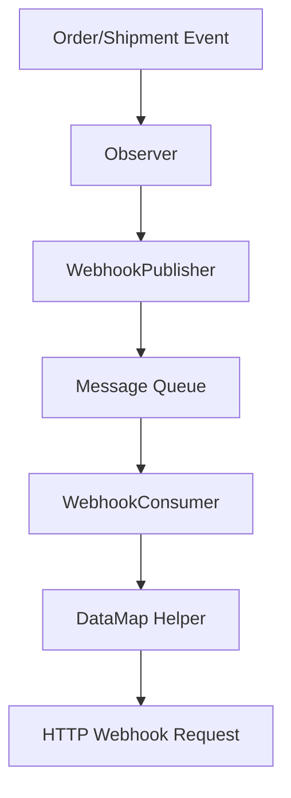

# Asynchronous Webhook Implementation

This document describes the implementation of Magento's Message Queue System to make webhook API calls non-blocking.

## Overview

The webhook module has been refactored to use Magento's message queue system, allowing webhook requests to be processed asynchronously. This improves performance by not blocking the main request thread while waiting for webhook responses.

## Architecture



## Implementation Details

### 1. Message Queue Configuration

- **communication.xml**: Defines the queue topic and message interface
- **queue_topology.xml**: Defines the queue topology and bindings
- **queue_consumer.xml**: Configures the consumer to process messages

### 2. Message Structure

- **WebhookEventInterface**: Defines the structure of webhook messages
- **WebhookEvent**: Implementation of the webhook event message

### 3. Publisher

- **WebhookPublisher**: Publishes webhook events to the message queue
- Observers now publish messages instead of making direct HTTP calls

### 4. Consumer

- **WebhookConsumer**: Processes webhook events from the queue
- Handles the actual HTTP request to the webhook endpoint

## Benefits

1. **Non-blocking**: The main request thread is no longer blocked by webhook HTTP requests
2. **Reliability**: Failed messages can be retried automatically
3. **Scalability**: Multiple consumers can process messages in parallel
4. **Monitoring**: Queue status can be monitored through Magento's admin interface

## Setup Instructions

### 1. Install Dependencies

Ensure your Magento installation has the message queue components installed:

```bash
php bin/magento setup:upgrade
php bin/magento setup:di:compile
```

### 2. Configure Message Queue

If you haven't already configured message queues in Magento, add this to your `env.php`:

```php
'queue' => [
    'amqp' => [
        'host' => 'localhost',
        'port' => 5672,
        'user' => 'guest',
        'password' => 'guest',
        'virtualhost' => '/'
    ]
]
```

### 3. Start the Consumer

Run the webhook consumer to process queued messages:

```bash
php bin/magento queue:consumers:start webhook.event.consumer
```

For production, consider running the consumer as a service with supervisor or similar process manager.

### 4. Monitor Queue Status

You can monitor the queue status through Magento's admin panel or by running:

```bash
php bin/magento queue:consumers:list
```

## Configuration Options

The consumer can be configured in `queue_consumer.xml`:

- **maxMessages**: Maximum number of messages to process in one batch
- **consumerInstance**: Type of consumer (batch or simple)

## Troubleshooting

### Consumer Not Processing Messages

1. Check if the consumer is running: `ps aux | grep webhook.event.consumer`
2. Check Magento logs for errors: `var/log/system.log`
3. Verify message queue configuration

### Messages Accumulating in Queue

1. Check if the webhook endpoint is responding
2. Verify API configuration in Magento admin
3. Check network connectivity to the webhook endpoint

## Backward Compatibility

The implementation maintains backward compatibility with the existing webhook configuration. All existing settings in the Magento admin panel continue to work as before.

## Performance Impact

- **Before**: Each webhook request blocked the main thread until the remote server responded
- **After**: Webhook requests are queued and processed asynchronously, significantly improving response times for order and shipment operations