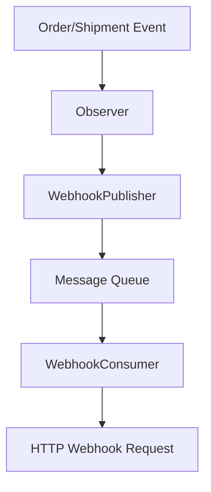

# Magento2 Webhook Module

This module enables sending Order Created and Shipment Created events from Magento2 to a configurable webhook endpoint.

## Overview

The module has been completely refactored to support a generic webhook system with admin configuration. It now supports multiple event types through a unified interface, making it easy to add new webhook events in the future.

**NEW: Asynchronous Processing** - The module now uses Magento's Message Queue System to process webhooks asynchronously, significantly improving performance by not blocking the main request thread.

## Quick Start

1. Install the module in your Magento 2 instance
2. Navigate to **Stores > Configuration > Webhook > Webhook Settings**
3. Enable webhooks and configure your API key and endpoint
4. Choose which events to send (Order Created, Shipment Created, or both)
5. Save configuration
6. Start the message queue consumer (see [Asynchronous Processing](#asynchronous-processing) section)

## Configuration

All webhook settings are now configurable through the Magento admin panel:

1. Navigate to **Stores > Configuration > Webhook > Webhook Settings**

### General Configuration
- **Enable Webhooks**: Turn webhooks on or off
- **API Key**: Your webhook API key (encrypted)
- **Webhook Host URL**: The webhook endpoint URL
- **API Revision**: The API revision to use

### Event Configuration
- **Enable Order Created Webhook**: Toggle order webhooks on/off
- **Order Created Event Name**: Custom event name for orders (default: "Placed Order Webhook")
- **Enable Shipment Created Webhook**: Toggle shipment webhooks on/off
- **Shipment Created Event Name**: Custom event name for shipments (default: "Shipment Created Webhook")

## Asynchronous Processing

The module now processes webhooks asynchronously using Magento's Message Queue System. This provides significant performance improvements:

### Benefits
- **Non-blocking**: Order and shipment operations complete immediately without waiting for webhook responses
- **Reliability**: Failed webhook requests are automatically retried
- **Scalability**: Multiple consumers can process webhooks in parallel
- **Monitoring**: Queue status can be monitored through Magento's admin interface

### Setup
1. Ensure your Magento installation has message queue components installed
2. Run the setup commands:
   ```bash
   php bin/magento setup:upgrade
   php bin/magento setup:di:compile
   ```
3. Start the webhook consumer:
   ```bash
   php bin/magento queue:consumers:start webhook.event.consumer
   ```
4. For production, configure the consumer to run as a service using supervisor or similar

### Architecture


## Events

The module sends webhooks for the following events:

### Order Created
- Triggered by: `checkout_onepage_controller_success_action`
- Dispatched when a one page checkout success page is rendered ([Adobe docs](https://developer.adobe.com/commerce/php/development/components/events-and-observers/event-list/#checkout_onepage_controller_success_action))
- **Note**: Webhooks are now processed asynchronously via message queue

### Shipment Created
- Triggered by: `sales_order_shipment_save_after`
- Dispatched when a shipment is created in Magento
- Includes comprehensive shipment data such as:
  - Shipment details (ID, increment ID, creation date)
  - Linked order information
  - Shipped items with quantities
  - Tracking numbers and carrier information
  - Customer information
  - Shipping address
- **Note**: Webhooks are now processed asynchronously via message queue

## Shipment Webhook Payload

The shipment webhook includes the following data:

### Customer Information
- Email, first name, last name, phone number
- Shipping address details

### Shipment Information
- Shipment ID and increment ID
- Order ID and increment ID
- Shipment date/time
- Shipping method

### Shipped Items
- Product ID, SKU, product name
- Quantity shipped
- Item price
- Order item ID

### Tracking Information
- Carrier code and title
- Tracking number(s)
- Tracking creation date

## File Structure

```
Webhook/
├── Webhook/
│   ├── Api/
│   │   └── Data/
│   │       └── WebhookEventInterface.php    # Message queue interface
│   ├── etc/
│   │   ├── adminhtml/
│   │   │   └── system.xml                  # Admin configuration
│   │   ├── communication.xml               # Message queue configuration
│   │   ├── config.xml                      # Default configuration values
│   │   ├── di.xml                          # Dependency injection
│   │   ├── events.xml                      # Event observers
│   │   ├── module.xml
│   │   ├── queue_consumer.xml              # Consumer configuration
│   │   └── queue_topology.xml              # Queue topology
│   ├── Helper/
│   │   └── DataMap.php                     # Generic webhook handler
│   ├── Model/
│   │   ├── WebhookConsumer.php             # Message queue consumer
│   │   ├── WebhookEvent.php                # Event message implementation
│   │   └── WebhookPublisher.php            # Message queue publisher
│   ├── Observer/
│   │   ├── ProcessPlacedOrder.php          # Order observer (async)
│   │   └── ProcessShipment.php             # Shipment observer (async)
│   └── registration.php
```

## Adding New Webhook Events

To add new webhook events:
1. Create a new observer in `Observer/` directory
2. Add the event to `etc/events.xml`
3. Add a payload mapping method in `Helper/DataMap.php`
4. Add configuration options in `etc/adminhtml/system.xml`
5. Update the `sendWebhookEvent()` method to handle the new event type

## Migration from Previous Version

If you were using the previous version of this module:
1. Your existing order webhook functionality will continue to work
2. You need to configure the API key in the admin panel (it was previously hardcoded)
3. The order webhook is now configurable and can be enabled/disabled

## Legacy Information

The previous version required editing code files to configure the webhook. This is no longer necessary - all settings are now configurable through the admin interface.

## Troubleshooting

### Consumer Issues
If webhooks are not being sent:
1. Check if the consumer is running: `ps aux | grep webhook.event.consumer`
2. Start the consumer: `php bin/magento queue:consumers:start webhook.event.consumer`
3. Check Magento logs: `var/log/system.log`

### Performance Monitoring
Monitor queue status:
```bash
php bin/magento queue:consumers:list
```

For detailed troubleshooting, see [README_ASYNC.md](Webhook/Webhook/README_ASYNC.md)